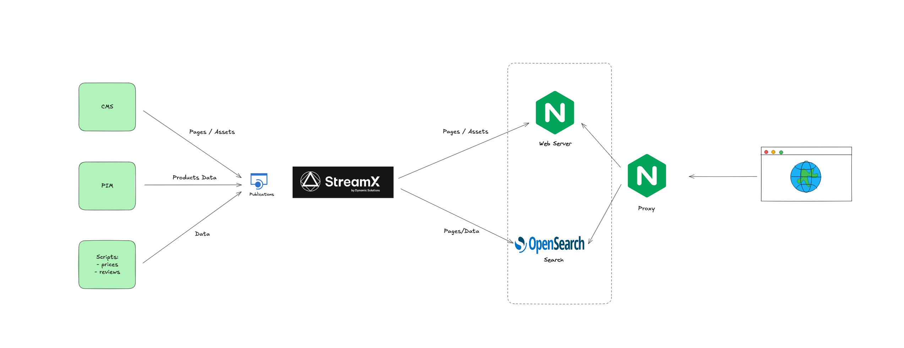

# PureSight Demo

The PureSight demo showcases an example usage of StreamX as a complete web solution. It consists of the following data sources:

- **WebSight CMS**: Provides content management capabilities.
- **PureSight PIM**: Acts as a source of product information.
- **Bash scripts**: Simulate a source of pricing data.



The **StreamX Mesh** is built using StreamX core components, which provide essential functionalities such as:

- Rendering engine
- Sitemap generator
- Web server
- Search service
- Other services

This setup enables the following capabilities:

- **Rendering HTML pages**
- **Generating Product Detail Pages (PDPs)**
- **Building a `sitemap.xml` file**
- **Exposing product data in JSON format for headless solutions**
- **Generating product listings**
- **Indexing and enabling search functionality**

The PureSight demo allows you to see each of these elements in action in real-time.

---

## Running the PureSight Demo

### Run StreamX Using [CLI](https://www.streamx.dev/guides/streamx-command-line-interface-reference.html)

**Note**: Tested with CLI version StreamX 1.0.1.

Start the mesh defined in `mesh.yaml`:

```bash
source env/local/.env.sh
streamx run -f mesh.yaml
```

Wait until the process completes.

### Run the Demo PIM

Start PIM:

```bash
source env/local/.env.sh
sh scripts/run-pim.sh
```

### Run WebSight CMS

```bash
source env/local/.env.sh
sh scripts/run-websight.sh
```

### Run Proxy Server

```bash
sh env/local/run-proxy.sh
```

### Verify the Setup

- Visit: [http://puresight.127.0.0.1.nip.io/homepage.html](http://puresight.127.0.0.1.nip.io/homepage.html).  
  The web server will serve a 404 error until some data is populated in StreamX.

- Demo PIM is available at:  
  **URL**: [http://pim.127.0.0.1.nip.io/#/login](http://pim.127.0.0.1.nip.io/#/login)  
  **Credentials**: `wsadmin/wsadmin`

- WebSight is available at:  
  **URL**: [http://cms.127.0.0.1.nip.io/](http://cms.127.0.0.1.nip.io/)  
  **Credentials**: `wsadmin/wsadmin`

---

## Ingest Data

### WebSight CMS

1. Go to: [http://cms.127.0.0.1.nip.io/apps/groovy#/etc/groovy-console/PureSight/publish-components.groovy](http://cms.127.0.0.1.nip.io/apps/groovy#/etc/groovy-console/PureSight/publish-components.groovy)  
   Click the **"Run"** button.  
   This action will ingest component renderers and configurations needed for dynamic components that are not managed by CMS.

2. Visit: [http://cms.127.0.0.1.nip.io/apps/websight/index.html/content/PureSight/pages](http://cms.127.0.0.1.nip.io/apps/websight/index.html/content/PureSight/pages).  
   Publish all the pages from the list (including pages in the subtree).

3. On the left-hand side, switch to **Assets Mode** and publish all assets.

---

### PureSight PIM

Visit: [http://pim.127.0.0.1.nip.io](http://pim.127.0.0.1.nip.io) and click the **"Sync All"** button.

---

### Prices

You can change the price of any product by passing the product ID and the desired price:

```bash
source env/local/.env.sh
sh scripts/prices/publish-price.sh B071FMSYNH 994
```

---

### Product Reviews

You can also add reviews for a product:

```bash
source env/local/.env.sh
sh scripts/reviews/publish.sh B071FMSYNH
```

---

# Sample Demo Scenario

## Part I - Dynamic Data in CMS Components

### Presented Capabilities

- CMS sites with real-time components at the speed and scale of cached content.
- Pre-rendered experiences that always reflect the latest changes in source systems.

---

#### Orient the Audience to the Screen

1. Present the homepage as it is and explain the dynamic component with a product listing.
2. Present a sample product page and explain that it is generated based on a page template from CMS and data from the PIM and pricing system.

---

#### Scenario

1. Open the CMS and edit the product listing component on the homepage.
    - Set the category to **Accent Furniture** and publish the page.

2. Publish the price **(99)** for product `B075X5TN2K`.

3. Refresh the homepage.

---

#### Explain What Happened in the Background

- The price update triggered regeneration of the product.
- **StreamX** regenerated the page fragment with the list of products in the "Accent Furniture" category (sorted by price, cheapest first).
- The homepage was requested.
- The HTTP server embedded the refreshed page fragment using **Server-Side Includes (SSI)**.
- The page was delivered with the updated list of products.

---

#### Key Observations

- No **Dispatcher cache flushing** is required.
- Dynamic listings remain up-to-date without re-rendering pages on CMS publishers, reducing the load and cost of maintaining multiple publisher instances.

---

#### Key Takeaway/Value

- **No need to republish** the page with dynamic content.
- **No cache refresh** is needed; the HTTP server delivers the same homepage.
- SSI embeds the latest data when the page is requested by visitors.
- The same approach can deliver **personalized content**.

---

## Part II - Resources Based on Multiple Sources

### Presented Capabilities

- Always up-to-date, **auto-generated sitemaps** integrating multiple source systems (WebSight CMS, PIM).
- Real-time search serving instant information from source systems.

---

#### Orient the Audience to the Screen

1. Present the **sitemap.xml** file generated based on:
    - PIM data
    - CMS pages

2. Present the **search functionality**.

---

#### Scenario

1. Unpublish product `B075X5TN2K` (if not already done).
2. Open the PureSight homepage and search for `B075X5TN2K` → Show **no results**.
3. Open the **sitemap.xml** file and search for `B075X5TN2K` → Show **no results**.
4. Open the PIM and publish the product.
5. Repeat the search on the PureSight homepage for `B075X5TN2K` → Show the match.
6. Open **sitemap.xml** → Show the product match.
7. Unpublish the blog page "Simplify Your Space: A Guide to Decluttering" from CMS.
8. Search for **"simplify-your-space"** in sitemap.xml → No results.
9. Search for **"simplify"** on the site → No results.
10. Publish the blog page
11. Show results in **sitemap.xml** and search.

---

#### Explain What Happened in the Background

- PIM informed StreamX about a **new product**.
- CMS informed StreamX about a **new page**.
- StreamX updated the **sitemap** and the **search index**.

---

#### Key Takeaway/Value

- **StreamX** ensures that delivery services always use **up-to-date information** from multiple systems.

---

## Part III - Multiple Sources Update the PDP

### Presented Capabilities

- Always up-to-date **Product Detail Page (PDP)** generated using data from multiple sources:
    - WebSight CMS
    - PIM
    - Price script
    - Reviews script

---

#### Orient the Audience to the Screen

- Present a PDP generated based on multiple sources.

---

#### Scenario

1. Open the PDP from the homepage listing for product `B075X5TN2K`.
    - Explain which data comes from which system.
2. Update the price for `B075X5TN2K` → Refresh the PDP and show the updated price.
3. Add a review for `B075X5TN2K` → Refresh the PDP and show reviews.
4. Update the product name in PIM for `B075X5TN2K` → Show the updated name on the PDP.
5. Modify the PDP template in CMS → Refresh the PDP and show the updated content.

---

#### Explain What Happened in the Background

- PIM informed StreamX about a **product data change**.
- Scripts informed StreamX about **price and reviews changes**.
- CMS informed StreamX about a **PDP template content change**.
- StreamX updated the resulting PDP for every piece of information from different systems.

---

#### Key Takeaway/Value

- StreamX ensures that **resources remain up-to-date** regardless of which source triggers the data change.